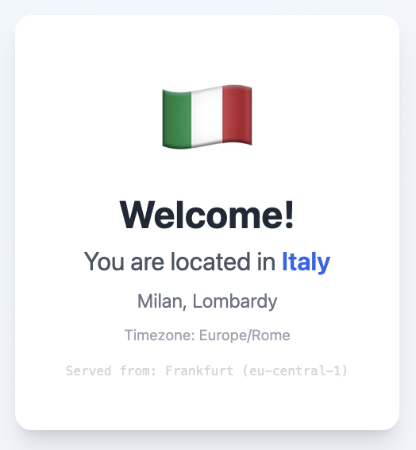

# Edge Geolocation Demo

A showcase of CloudFront's native geolocation capabilities using Lambda@Edge. Displays your location (country, city, region, timezone) detected at the edge — no API calls, no database lookups.

🌐 **[Live Demo](https://edge-geolocation.demos.jesusrugama.com)**



## How It Works

1. You visit the site
2. CloudFront detects your location at the nearest edge location
3. Lambda@Edge injects geo headers into the response
4. The React app reads the headers and displays your location

No external geolocation APIs. No server-side processing. Just CloudFront doing what it does best.

## Tech Stack

| Layer | Technology |
|-------|------------|
| **Frontend** | React, TypeScript, Vite, TailwindCSS |
| **Edge Function** | Lambda@Edge (Node.js/TypeScript) |
| **Infrastructure** | Terraform (S3, CloudFront, ACM, Route53, Lambda) |
| **CI/CD** | GitHub Actions with OIDC authentication |

## Project Structure

```
├── website/           # React frontend
├── edge-function/     # Lambda@Edge function (TypeScript)
├── terraform/         # Infrastructure as Code
└── .github/workflows/ # CI/CD pipeline
```

## Architecture

```
┌─────────────┐     ┌─────────────────┐     ┌─────────────┐
│   Browser   │────▶│   CloudFront    │────▶│  S3 Bucket  │
└─────────────┘     │  + Lambda@Edge  │     └─────────────┘
                    └─────────────────┘
                           │
                    Injects geo headers:
                    • x-geo-country
                    • x-geo-country-name
                    • x-geo-city
                    • x-geo-region-name
                    • x-geo-latitude
                    • x-geo-longitude
                    • x-geo-time-zone
                    • x-aws-region
```

## Features

- **Zero-latency geolocation** — Data comes from CloudFront, not an external API
- **Privacy-friendly** — No IP logging, no third-party services
- **Infrastructure as Code** — Fully reproducible with Terraform
- **Secure CI/CD** — GitHub Actions with OIDC (no stored AWS credentials)
- **Manual Lambda versioning** — Controlled edge deployments

## Local Development

### Website
```bash
cd website
npm install
npm run dev
```

### Edge Function
```bash
cd edge-function
npm install
npm run build
```

## Deployment

Infrastructure is managed with Terraform:
```bash
cd terraform
terraform init
terraform plan
terraform apply
```

The GitHub Actions workflow automatically:
1. Builds the React app
2. Syncs to S3
3. Builds and uploads the Lambda function
4. Invalidates CloudFront cache

## Built With AI

This project was built in ~3 hours using AI-assisted development:

- **Frontend**: Generated with [bolt.new](https://bolt.new)
- **Infrastructure & Backend**: Built in [Windsurf](https://windsurf.ai) with Claude Opus

The AI handled Terraform configuration, Lambda@Edge setup, GitHub Actions workflow, and iterative refinements. Human oversight for architecture decisions and AWS-specific configurations.

## License

MIT
